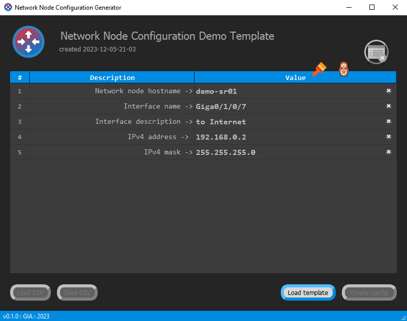

# NNCG "Network Node Configuration Generator"

**A simple templates-based config generator for network devices.**

Usefull for industrial type equipment, like : ***Routers, Switches, DSLAM, OLT, WDM and etc...***

Designed to facilitate routine operations for network engineers during mass configuration of similar devices. Once you create a template, you can reuse it further, changing variables such as hostname, IP addresses, masks, mac addresses, network protocol settings, names and descriptions of interfaces. The type of the variable doesn't matter.

The application works on the principle of substituting data values described in the template header using key values enclosed in curly braces (tunable). The template file is a simple text file, but the file header must conform to a specific format for the application to function correctly. This file is prepared by an engineer in any text editor. The example **"template_example.txt"** is used as a basis.

The application also provides a function for saving entered values in CSV format in case you do not have to re-enter rarely changed variables each time.

Having a template file and once saved a CSV dump, you can make your life much easier, and in the time freed from routine, drink coffee or read documentation about network technologies.

The software is written using the Qt 6.6.1 framework and uses icons from https://icons8.com website.

## Example of template file header

**The following fields are mandatory, although the values after the colons may be missing.**

NETWORK_NODE_CONFIG_TEMPLATE  
SOFTWARE_VERSION:  
TITLE:  
COMMENT:  
LOGO:  
BRAND_COLORS:  
DELIMITER_OPEN:  
DELIMITER_CLOSE:  
\#BEGIN_VARIABLES  
\#END_VARIABLES  

***NETWORK_NODE_CONFIG_TEMPLATE***
> First line of the template file.

***SOFTWARE_VERSION***
> After the colon, the minimum software version required for
> open the file. In the current version of the application this field is not checked,
> made for the future. It is recommended to always set it to 0.1.0.

***TITLE***
> Template title. Displayed in large font. It is recommended to always fill it out.

***COMMENT***
> Comment displayed below the title in smaller font.
> It is recommended to indicate the creation date or version of the template here, but it is acceptable
> any other text.

***LOGO***
> Logo file. Must be in the same directory as the file
> template. It is recommended to use framed images in the format
> PNG with a resolution of no more than 512x512. When empty or in case
> errors, the application logo is displayed.

***BRAND_COLORS***
> Using a template you can color the interface
> applications in different colors. Listed after a colon, separated by a comma
> RGB values for background, then RGB values for text, 6 in total
> values. Decimal numbers are used, for example:
>
     BRAND_COLORS:0,139,224,255,255,255

***DELIMITER_OPEN  
DELIMITER_CLOSE***
> Opening and closing variable name delimiters. They can
> consist of more than 1 character. For empty values there will be
> use curly braces { }. Examples:
>
     DELIMITER_OPEN:("
     DELIMITER_CLOSE:")
>
> or
>
     DELIMITER_OPEN:<('
     DELIMITER_CLOSE:')>  

***\#BEGIN_VARIABLES  
\#END_VARIABLES***
> Mark the beginning and end of a block of variables.

## List of variable types and description of checks performed

***Domname***
> checking the correctness of the domain name, max. 253 characters, only Latin and hyphens

***Prompt***
> prompt in the device console, max. 64 unicode characters

***Text***
> plain text without language restrictions, max. 255 unicode characters

***IPv4***
> checking for compliance with IPv4 address

***IPv6***
> checking for compliance with IPv6 address

***Unsigned***
> unsigned 32-bit integer in the range from 0 to 4_294_967_295

***Password***
> password, hidden input field, max. 128 unicode characters

***MASKv4***
> checking the correctness of the mask for IPv4 in dotted format

***MASKv4Len***
> IPv4 mask length, integer from 0 to 32

***MASKv6Len***
> mask length for IPv6 address, integer from 0 to 128

***WildcardV4***
> inverted wildcard bitmask for IPv4, check for correctness

***WildcardV6***
> inverted wildcard bitmask for IPv6, check for correctness

***Hash***
> hash sequence, only Latin and special characters, max. 128 characters

***Separator***
> serves to divide variables into logical blocks and internal comments

Capital and small letters in types do not play a role. For example, the following names are identical: ***Domname***, ***dOMName***, ***DomName***, etc.  

**The variable block is located between the \#BEGIN_VARIABLES and \#END_VARIABLES fields.**

Each line must have the following format:

\#\<delimiter_open\>\<variable_name\>\<delimiter_close\>,\<comment\>,\<variable_type\>

The comment must be surrounded by double quotes.

For example :

     DELIMITER_OPEN:{
     DELIMITER_CLOSE:}
     #BEGIN_VARIABLES
     #{domname}, "Domain name :", Domname
     #{prompt}, "System prompt :", Prompt
     #{node}, "Node ID number :", Unsigned
     #{lpb_v4_ip}, "Interface Loopback IPv4 address :", IPv4
     #END_VARIABLES

After the header, the device configuration text is inserted, where variable values are replaced by their names, framed by delimiters.

For example :

     NETWORK_NODE_CONFIG_TEMPLATE
     SOFTWARE_VERSION:0.1.0
     TITLE:Example
     COMMENT:demo version
     LOGO:brandlogo.png
     BRAND_COLORS:0,139,224,255,255,255
     DELIMITER_OPEN:{
     DELIMITER_CLOSE:}
     #BEGIN_VARIABLES
     #{domname}, "Domain name :", Domname
     #{lpb_v4_ip}, "Interface Loopback IPv4 address :", IPv4
     #END_VARIABLES
     hostname {domname}
     interface LoopBack0
      ip address {lpb_v4_ip} 255.255.255.255
      ....
