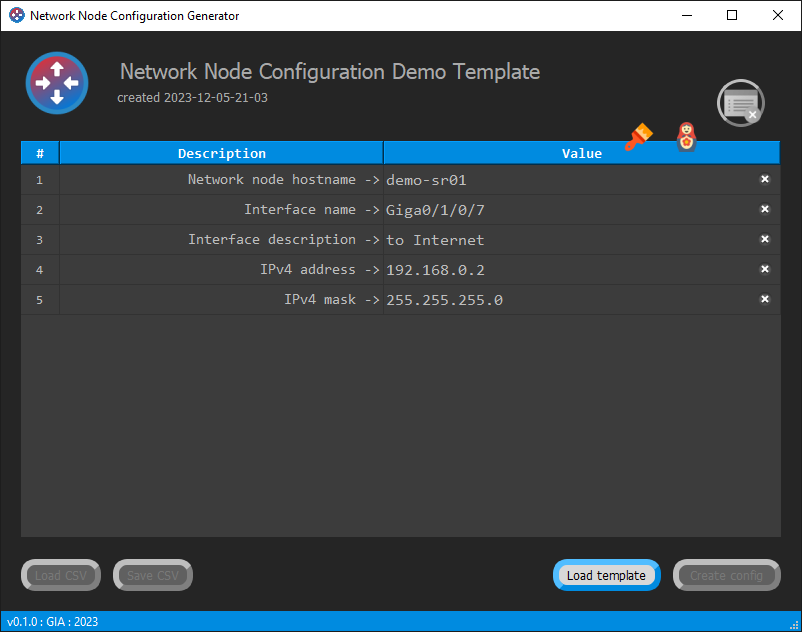

# NNCG "Network Node Configuration Generator"

<b>A simple templates-based config generator for network devices.</b>

Usefull for industrial type equipment, like : Routers, Switches, DSLAM, OLT, WDM and etc...

Designed to facilitate routine operations for network engineers during mass configuration of similar devices.
Once you create a template, you can reuse it further, changing variables such as hostname, IP addresses, masks, mac addresses, network protocol settings,
names and descriptions of interfaces. The type of the variable doesn't matter.

The application works on the principle of substituting data values described in the template header using key values enclosed
in curly braces (tunable). The template file is a simple text file, but the file header must conform to a specific format for the application to function correctly.
This file is prepared by an engineer in any text editor. The example <b>"template_example.txt"</b> is used as a basis.

The application also provides a function for saving entered values in CSV format in case you do not have to re-enter rarely changed variables each time.

Having a template file and once saved a CSV dump, you can make your life much easier, and in the time freed from routine, drink coffee or read documentation about network technologies.

The software is written using the Qt 5.14.2 framework.